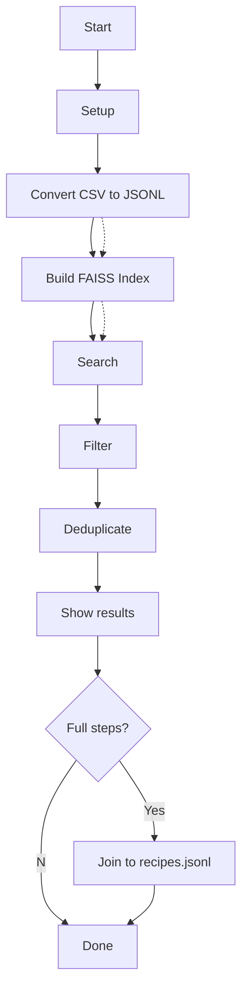

# Recipes RAG — CLI-Only Pipeline (No Server)

This repo contains a **three-stage pipeline** to turn a recipes CSV into a searchable **local FAISS index** and query it from the command line. It does **not** include a web server or API layer.

> **At a glance**
> 1) Convert CSV → JSONL (`convert_to_rag_jsonl.py`)
> 2) Build FAISS index (`build_faiss_index.py`)
> 3) Search the index (`search_faiss_index.py`)

---

## Folder layout (what you will see)

```
recipes_model/
├─ convert_to_rag_jsonl.py     # CSV -> rag_jsonl/{recipes.jsonl, chunks.jsonl}
├─ build_faiss_index.py        # chunks.jsonl -> index_artifacts (FAISS + sidecars)
├─ search_faiss_index.py       # query the FAISS index with auto/manual filters
├─ (ignored) data/             # place CSVs here (not committed)
├─ (generated) rag_jsonl/      # JSONL artifacts from the converter
└─ (generated) index_artifacts/# FAISS index + sidecars (texts, metas, manifest)
```

**Why artifacts are ignored:** they can be large, derived, and may contain private data. The code + README is enough to reproduce them locally.

---

## Prerequisites

- **Python** 3.9+ (64‑bit recommended)
- Windows PowerShell or bash shell
- Internet access **once** to download the embedding model (`sentence-transformers`)
- Packages: `pandas`, `sentence-transformers`, `faiss-cpu`, `tqdm`, `python-dotenv`

> Tip: keep dependencies in `requirements.txt` or `pyproject.toml`.

---

## Setup (one time)

```powershell
# from the project root
python -m venv .venv
.\.venv\Scripts\python.exe -m pip install -U pip
.\.venv\Scripts\python.exe -m pip install -r requirements.txt
```

Place your dataset in `data/`, for example:
```
data/updated_combined_data_categories_embedded.csv
```

---

## Step 1 — Convert CSV → JSONL

**Script:** `convert_to_rag_jsonl.py`

**What it does (logic):**
- Reads the CSV from `data/`.
- Creates **`rag_jsonl/recipes.jsonl`**: one line per recipe with `id`, `title`, **full text** (ingredients + steps), and `metadata` (minutes, diets, allergens, cuisine, and ideally meals + ingredients).
- Creates **`rag_jsonl/chunks.jsonl`**: overlapping **chunks** of recipe text for better retrieval, each with compact metadata copied from the recipe.

**Why chunking?** Retrieval works better on chunks than on entire documents—more precise matches and higher recall.

**Typical flags:** `--csv <path>`, `--out rag_jsonl`, `--chunk-tokens 400`, `--overlap 80`

Outputs:
```
rag_jsonl/
  recipes.jsonl   # per-recipe records (full)
  chunks.jsonl    # per-chunk records (used by the index)
```

---

## Step 2 — Build FAISS index

**Script:** `build_faiss_index.py`

**What it does (logic):**
- Loads `rag_jsonl/chunks.jsonl`.
- Embeds each chunk with **Sentence-Transformers** (e.g., `all-MiniLM-L6-v2`).
- Stores vectors in **FAISS** and writes sidecar files aligned 1:1 with index rows:
  - `recipes_chunks.index` — FAISS vectors
  - `texts.jsonl` — chunk texts
  - `metas.jsonl` — chunk metadata (minutes, diets, meals, ingredients…)
  - `manifest.json` — records the embedding model used (must match at query time)

**Typical flags:** `--chunks rag_jsonl/chunks.jsonl`, `--out index_artifacts`

Outputs:
```
index_artifacts/
  recipes_chunks.index
  texts.jsonl
  metas.jsonl
  manifest.json
```

---

## Step 3 — Search the index

**Script:** `search_faiss_index.py`

**What it does (logic):**
1. Loads `index_artifacts/` and the embed model from `manifest.json`.
2. Embeds the **user query**.
3. Retrieves top‑K **chunks** via FAISS similarity.
4. Applies **hard filters** (from auto‑parsing the query or manual flags):
   - `max_minutes` (e.g., “under 30 minutes”)
   - `diet` / `meal` (falls back to text if metadata is missing)
   - `exclude_allergen`, `exclude_ingredients`
   - Optional: `exclude_title` (avoid sauces/dressings for “dinner” queries)
5. **Deduplicates by recipe (`doc_id`)** so only the best chunk per recipe remains.
6. Prints results (title, minutes, diets, cuisine, score, and a short snippet).

**Notes about steps/instructions:**
- The search result shows a **snippet** from the best chunk.
- The **full step‑by‑step** lives in `recipes.jsonl`. If you need to display complete steps, extend the search script to join on `doc_id` and print them.

**Typical flags:**
- Required: `--index-dir index_artifacts`, `--query "vegan dinner under 30 minutes"`, `--top-k 10`
- Optional filters: `--filter-max-minutes 30`, `--filter-diet vegan`, `--filter-meal dinner`, `--exclude-ingredients "chicken, beef, pork, fish"`, `--exclude-title "dressing,sauce"`
- Debug: `--debug 8` (inspect raw candidates before filtering)

---

## When to rebuild what?

- **CSV changed** or you changed **converter logic/metadata** → re-run **Step 1** then **Step 2**.
- **Embedding model changed** → re-run **Step 2** (the new model is recorded in `manifest.json`).
- Only search formatting or filter behavior changed → just re-run **Step 3**.

---

## Troubleshooting

- **No results with filters:** your dataset may lack `meals`/`diets` metadata. Loosen filters or enhance the converter to populate those fields, then rebuild.
- **HF 401 (Unauthorized) on public models:** clear tokens in the current shell:
  ```powershell
  Remove-Item Env:HUGGINGFACE_HUB_TOKEN -ErrorAction SilentlyContinue
  Remove-Item Env:HF_TOKEN -ErrorAction SilentlyContinue
  ```
- **File not found:** run from the repo root or use **absolute paths** for `--csv`, `--chunks`, `--index-dir`.
- **VS Code venv activation issues:** call the interpreter directly with `.\.venv\Scripts\python.exe`.

---

## Tools used

- **pandas** — CSV I/O & preprocessing
- **sentence-transformers** — text embeddings (Hugging Face)
- **faiss-cpu** — vector index & nearest‑neighbor search
- **tqdm** — progress bars
- **python-dotenv** — optional env config

---

## Diagram (Mermaid)



---

## License

MIT (or your preferred license).
